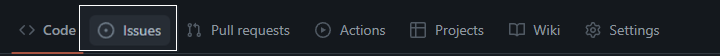
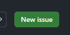
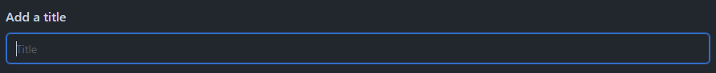
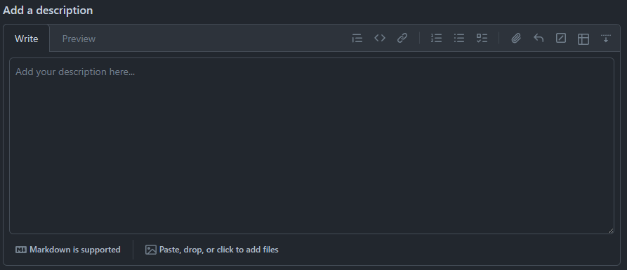
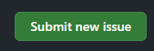
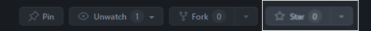

# Linked List - Student Data Collector

<!-- PROJECT LOGO -->
 

  

  <h3 align="center">Calculator</h3>

  A simple Calculator System which applies Linked List.

 

---

 
 

<!-- TABLE OF CONTENTS -->

  
Table of Contents

  <ol>
    <li>
      <a href="#project-overview">Project Overview</a>
    </li>
    <li>
      <a href="#versions">Versions</a>
      <ol>
        <li>
          <a href="version-1">Version 1</a>
        </li>
      </ol>
    </li>
    <li>
      <a href="#how-to">How to</a>
      <ol>
        <li>
          <a href="#fork">Fork</a>
        </li>
        <li>
          <a href="#make-issue">Make an Issue</a>
        </li>
        <li>
          <a href="#follow-star">Follow and Star</a>
        </li>
      </ol>
    </li>
  </ol>

 
 

---

## Project Overview

This is the system created to understand the use cases of Linked List. Having Multiple Versions and different level of knowledge application it goals to help student understand Linked List Logic and possibilites it could open with different scenarios and situations and limits.

 

(<a href="#readme-top">back to top</a>)

---

## Versions

This is the system created to understand the use cases of Linked List. Having Multiple Versions and different level of knowledge application it goals to help student understand Linked List Logic and possibilites it could open with different scenarios and situations and limits.

### Student Data Collector
Versions:
- with Explanation (ongoing)
- without explanation

#### Features
- Doubly Linked List
- Create and Traverse

 

(<a href="#readme-top">back to top</a>)

---

## How to

### Fork
You can make your own copy of the project by Forking the project.

You can contribute by doing Pull Request after you modify the project. 

 
 

### Make an Issue
If you encounter any issues or bugs, please create an issue on the GitHub repository.

Steps:

1. Find the Issue Tab

2. Find the New Issue Button

4. Add a Short Title

6. Add Descriptions

 

Format of Description

* Problem - Describe the problem
* Step-by-Step of how the problem occur, if possible with screen-shots
* if there is variables, include at the bottom

---

Format sample:

The problem is something like this and it does this but should do this, im using mac laptop and i use this kind of ide.

Step-by-Step:
Step 1: Open the terminal

Step 2: Choose option 2

Step 3: Enter Values

Step 4: Problem Occur here that should be something like this but it does this.

Variables:
the values I placed are; 
1 - for registration
2 - Dela Cruz for Last name

---

1. Submit

 

(<a href="#readme-top">back to top</a>)

---

### Follow and Star
If you find this project interesting, consider giving it a star on GitHub. You can also follow the repository for updates and notifications.

 

(<a href="#readme-top">back to top</a>)

